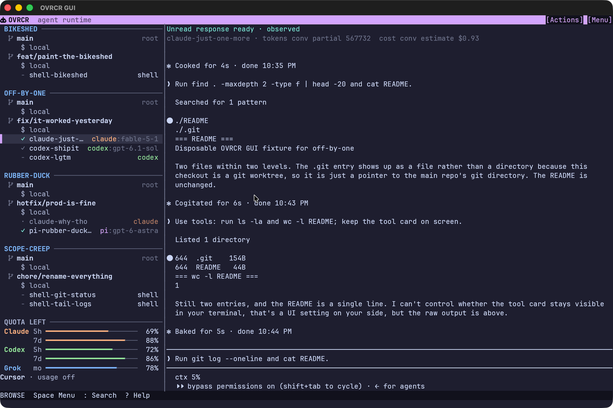
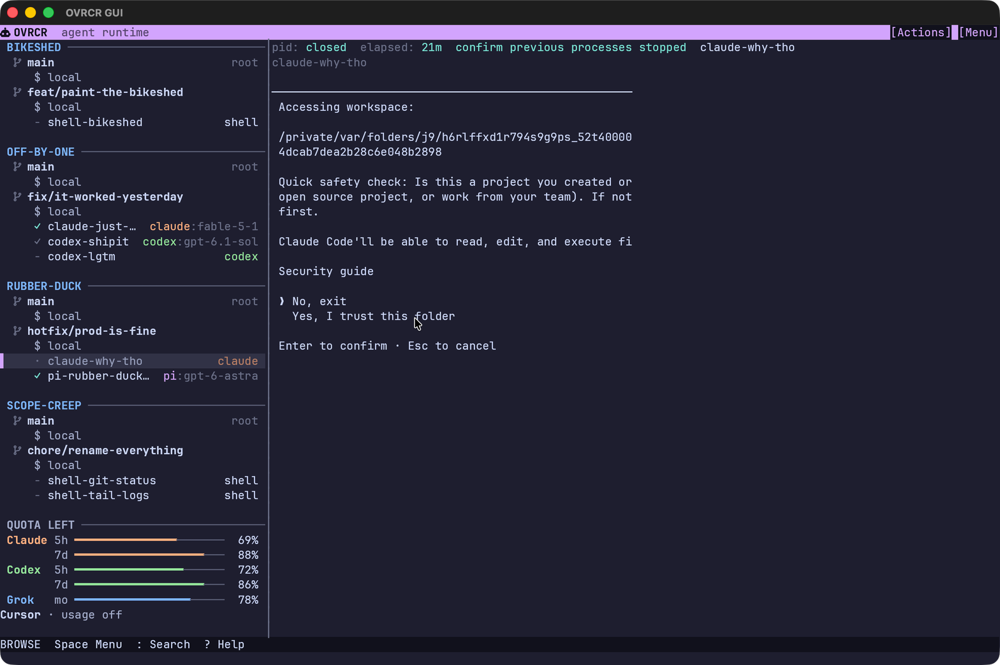
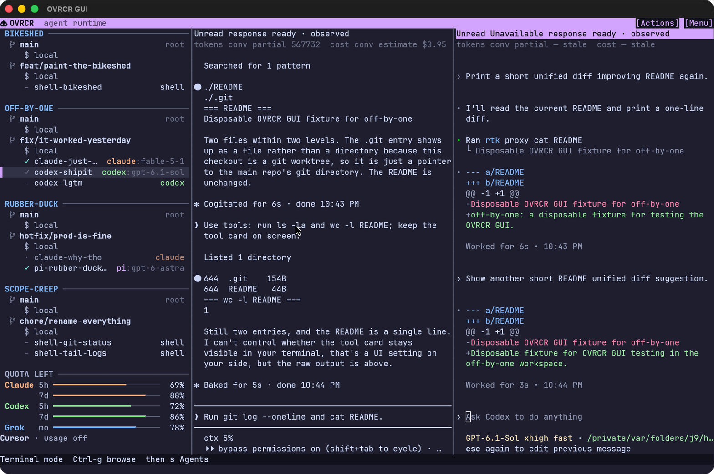

# OVRCR

**Yet another place to run coding agents. This one is Rust, so it’s fast and you get to feel smug about it.**

[](LICENSE)
[](https://www.rust-lang.org/)
[](#requirements)

## About

Agent runtimes and terminal multiplexers are everywhere. On a checklist they all look the same.

OVRCR is for a pile of coding-agent PTYs across a pile of worktrees. Register a Git repo, create a workspace (it makes the worktree), start Claude, Codex, Pi, Grok, Hermes, OMP, Cursor Agent, or a shell. One Rust server owns the sessions.

Eight themes in Appearance, because your quota crisis deserves better lighting: Catppuccin Mocha (default), Catppuccin Latte, Tokyo Night, Dracula, Gruvbox Dark, Gruvbox Light, Nord, Rosé Pine.

## Screenshots

<p align="center">
  
</p>

<table>
  <tr>
    <td width="50%">
      
    </td>
    <td width="50%">
      
    </td>
  </tr>
</table>

## Why this instead of tmux + coping

- **Git-shaped.** Projects and worktree workspaces, not a flat session list. Creating a workspace creates the branch, the worktree, and (by default) a local shell. Dirty or foreign worktrees are refused.
- **PTYs outlive the UI.** `q` detaches the dashboard; agents keep running (and burning tokens). Reattach rebuilds from the live process.
- **Status is reported, not inferred.** Busy / waiting / Ready / context come from provider hooks. Silence is not idle. Reporting depth varies — see the [support matrix](docs/agent-reporting-support.md).

## Install

Pre-1.0. Build from source:

```sh
git clone https://github.com/xlyk/ovrcr.git
cd ovrcr
cargo build -p ovrcr --release
install -m 755 target/release/ovrcr ~/.local/bin/ovrcr
ovrcr --version
```

Client and server must match on the wire protocol `ovrcr --version` prints.

## Quickstart

```sh
ovrcr project add myapp ~/Code/myapp --workspace-root ~/Code/workspaces/myapp
ovrcr workspace create --project myapp --new-branch feature/cleanup --base main
ovrcr new --project myapp --workspace feature/cleanup --name review -- claude
ovrcr
```

Dashboard: `j`/`k` select, `Enter` focus, `Ctrl-g` browse, `q` detach.

## Features

- One or two panes; Browse, Terminal, Copy, and History modes.
- After server restart, retained rows reopen a fresh shell in place; certified Claude conversations can resume by UUID. Terminal output is not restored across server restart.
- 512 rows of scrollback; keyboard selection; OSC52 clipboard copy.
- Pause / resume via SIGSTOP / SIGCONT on the session process group.
- CLI with `--json` on every resource command.
- Optional: scheduled Pi tasks in fresh worktrees; macOS Bridge notifications.
- Theme pick list in Settings (or `theme` in `dashboard.toml`). Hot-swaps without restart. Does not fix your agents.

## Requirements

- macOS or Linux
- Rust 1.95 or newer (edition 2024; optional GUI helper’s `eframe` sets the floor)
- Git
- Optional: [Pi](docs/scheduled-tasks.md) for scheduled tasks; macOS [Bridge](native/bridge/README.md) for notifications

## Docs

- [Dashboard](docs/dashboard.md) — modes, keys, notifications, quota, events
- [CLI reference](docs/cli-reference.md)
- [Agent reporting](docs/agent-reporting.md) · [Claude setup](docs/claude-code-setup.md) · [Support matrix](docs/agent-reporting-support.md)
- [Scheduled tasks](docs/scheduled-tasks.md) · [Provider quota](docs/provider-quota.md)
- [`AGENTS.md`](AGENTS.md) — invariants for contributors and coding agents

## Contributing

Start with [`AGENTS.md`](AGENTS.md), then open an issue or PR.

```sh
cargo test -p ovrcr
```

## License

OVRCR is licensed under the MIT License. See [`LICENSE`](LICENSE).
