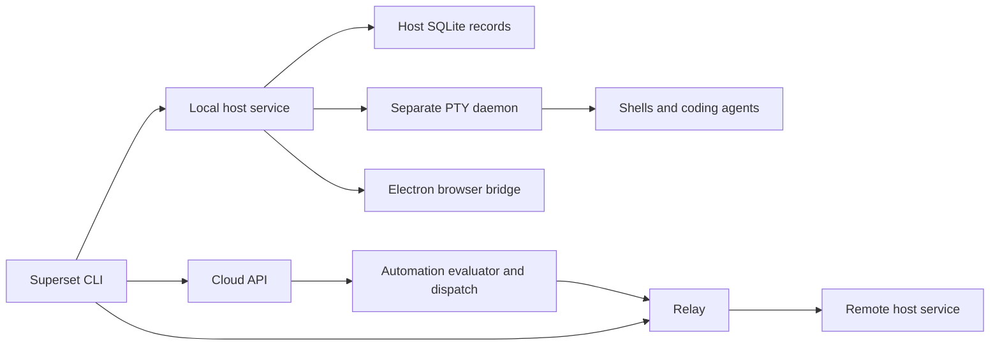

# Superset CLI: feature inventory and implementation research

Prepared for Kyle · 5 September 2026 · Input to a later OVRCR feature discussion

Superset’s CLI covers the complete workflow around an agent session: register a repository, create an isolated workspace, launch an agent, inspect and send terminal input, link work to a task, schedule future launches, and publish reviewable output. It also reaches into desktop settings and browser panes. Its implementation combines local process management with account services, a network relay, and an Electron application.

The installed CLI exposes **76 executable commands**. The current repository exposes **94**, but the extra 18 have not shipped in the inspected 1.26.0 release tag. The [command reference](command-reference.md) contains every installed command’s arguments and flags, the source declarations for all 18 additions, and all **35 installed settings**. Counts exclude aliases and help-only command groups.

This report inventories behavior and identifies distinctions relevant to OVRCR. It does not select features or change OVRCR’s approved design.

## Evidence and version boundaries

| Surface | Verified version or revision | What was checked |
| --- | --- | --- |
| Installed desktop bundle | CLI 1.25.1 | Binary version; recursive help for all 76 commands; selected read operations |
| Installed release source | `108b9bf0901c61ff5192874cab285054eb1e88fe` | Command tree agrees exactly with installed help |
| Published CLI 1.26.0 | `7f14df6f51173dd8c3dcd07cb55fa7ee37d74869` | GitHub release, tag and command-tree comparison; also 76 commands |
| Repository main | `42bd65b92c7c7e30187160af8c3fca49b0f7556a` | 94 command handlers plus host, PTY, scheduler, SDK and MCP implementation |
| OVRCR | Current local README and approved design | Comparison baseline; no implementation changes or OVRCR tests |

GitHub lists CLI 1.26.0 as a prerelease published on **4 September 2026 at 06:51:43 UTC**. The desktop 1.26.0 release is separately marked non-prerelease. A package version on `main` therefore cannot establish which features are in a downloadable binary. [CLI release](https://github.com/superset-sh/superset/releases/tag/cli-v1.26.0), [desktop release](https://github.com/superset-sh/superset/releases/tag/desktop-v1.26.0).

Two changes are easy to miss:

- Published 1.26.0 adds **directory publishing** to the existing `pages publish` command. The installed 1.25.1 command accepts one HTML file.
- After that release, `main` adds **15 plugin commands, two MCP client commands, and one skill-list command**, plus `--model` on `agents create` and `workspaces create`. These are source features, not installed features. Page document upload also changes after the release.

These distinctions come from comparing all three Git trees, rather than assuming the online documentation matches the installation. [Installed command tree](https://github.com/superset-sh/superset/tree/108b9bf0901c61ff5192874cab285054eb1e88fe/packages/cli/src/commands), [1.26.0 tree](https://github.com/superset-sh/superset/tree/7f14df6f51173dd8c3dcd07cb55fa7ee37d74869/packages/cli/src/commands), [inspected main tree](https://github.com/superset-sh/superset/tree/42bd65b92c7c7e30187160af8c3fca49b0f7556a/packages/cli/src/commands).

Unless explicitly marked **live**, implementation findings below describe the pinned `main` source. They do not establish that an operation completed successfully on this machine or that every runtime detail matches its older desktop bundle.

## What worked on this machine

The executable shim is `/Users/xlyk/.superset/bin/superset`. It points to `/Applications/Superset.app/Contents/Resources/resources/bin/superset`. This shell did not include the shim directory in `PATH`; invoking the absolute path worked.

| Read operation | Observed result |
| --- | --- |
| `--version`, recursive `--help` | 1.25.1; 76 leaf commands, with no census gaps |
| `auth whoami --json` | Succeeded; credentials and an active organization resolved |
| `hosts list --json` | Succeeded; two host records returned |
| `settings list --json` | Succeeded; 35 typed settings returned |
| `settings theme list --json` | Succeeded |
| `status --json` | `running: false`, `stale: true` |
| `projects list`, `workspaces list` | Failed: `Host service manifest is stale (recorded PID is dead)` |
| `agents list` without a target | Failed: `Target host required`; this command needs `--local` or `--host` even though several other reads default locally |
| `update --check --json` | Refused because the CLI updates with the desktop app |

The stale host blocked live workspace, agent and terminal evaluation. Existing workspaces, terminal input, schedules, settings and installed software were not deliberately changed. No feedback was sent and no pages were published. Authentication middleware can refresh its own credentials during read operations.

The host error suggests `superset start`, but the bundled distribution does not include the standalone host binary. Bundled CLI startup and updates have different constraints from the standalone package. The desktop owns its bundled host; a headless installation needs the standalone distribution. [Distribution distinction](https://github.com/superset-sh/superset/blob/42bd65b92c7c7e30187160af8c3fca49b0f7556a/packages/cli/src/lib/env.ts), [host spawning](https://github.com/superset-sh/superset/blob/42bd65b92c7c7e30187160af8c3fca49b0f7556a/packages/cli/src/lib/host/spawn.ts), [update guard](https://github.com/superset-sh/superset/blob/42bd65b92c7c7e30187160af8c3fca49b0f7556a/packages/cli/src/commands/update/command.ts).

## Command map

Every command in this table is present in installed 1.25.1. Prefix each with `superset`. Exact syntax, aliases and defaults appear in the [reference](command-reference.md).

| Area | Commands | Purpose |
| --- | --- | --- |
| Projects | `projects list`, `create`, `setup` | Register or attach repositories to a host |
| Workspaces | `workspaces list`, `get`, `create`, `update`, `delete`, `open` | Isolated Git worktrees and projectless scratch sessions |
| Agents | `agents list`, `create` | Discover configured launch definitions; start, resume, fork or hand off work |
| Terminals | `terminals create`, `list`, `read`, `send`, `close` | Start PTYs and control existing sessions |
| Terminal scripts | `scripts add` | Save reusable terminal launches in the desktop app |
| Tasks | `tasks list`, `get`, `create`, `update`, `delete`, `statuses list` | Organization task records and provider-linked metadata |
| Automations | `automations list`, `get`, `create`, `update`, `delete`, `pause`, `resume`, `run`, `logs`, `prompt get`, `prompt set` | Schedule and inspect future agent launches |
| Pages | `pages publish`, `list`, `get`, `versions`, `pull`, `comments list`, `comments reply`, `comments resolve`, `watch list`, `watch stop` | Versioned documents and human feedback routed to an agent |
| Browser | `browser list`, `open`, `navigate`, `eval`, `screenshot`, `console`, `cdp`, `import-login` | Control desktop browser panes |
| Hosts | `hosts list`, `set-wake`, `wake` | Discover machines and invoke configured wake commands |
| Local service | `start`, `status`, `stop` | Operate and inspect the host service |
| Authentication | `auth login`, `whoami`, `logout` | Browser login or API-key credentials |
| Organizations | `organization list`, `switch`, `members list` | Select account context and find members |
| Settings | `settings list`, `get`, `set`, `reset`; `settings theme list`, `get`, `set`, `import`, `export`, `remove` | Desktop preferences and theme management |
| Maintenance and support | `update`, `feedback submit` | Standalone binary updates; private support submissions |

## How commands reach their targets

Superset has three relevant execution locations: the local host service, a remote host reached through the relay, and the cloud API. Browser commands add a fourth dependency: the Electron desktop attached to the host.

Local host calls use an organization-specific manifest, a loopback tRPC endpoint and the manifest’s bearer token. A dead manifest PID produces an error rather than silently sending the request through the cloud. Remote calls resolve the relay and address a concrete organization/host routing key. WebSocket endpoints carry terminal and browser traffic. [Host target resolution](https://github.com/superset-sh/superset/blob/42bd65b92c7c7e30187160af8c3fca49b0f7556a/packages/cli/src/lib/host-target/resolveHostTarget.ts#L54-L122).

Workspace and project listings cover **one host**. The desktop provides the cross-host view. Creation of projects and workspaces requires explicit `--local` or `--host`; terminal commands default to this machine. `agents list` also requires an explicit target. Commands do not share one universal host-default rule. [Workspace listing boundary](https://github.com/superset-sh/superset/blob/42bd65b92c7c7e30187160af8c3fca49b0f7556a/packages/cli/src/lib/host-workspaces/workspacesOnHost.ts), [agent listing](https://github.com/superset-sh/superset/blob/42bd65b92c7c7e30187160af8c3fca49b0f7556a/packages/cli/src/commands/agents/list/command.ts).

“Offline-friendly” describes the **local transport**, not a guarantee that every CLI invocation works without network access. Most commands pass through authentication middleware first. OAuth nearing expiry triggers a network refresh, and host startup queries organization membership. Desktop settings bypass cloud authentication. [Credential resolution](https://github.com/superset-sh/superset/blob/42bd65b92c7c7e30187160af8c3fca49b0f7556a/packages/cli/src/lib/resolve-auth.ts), [startup](https://github.com/superset-sh/superset/blob/42bd65b92c7c7e30187160af8c3fca49b0f7556a/packages/cli/src/commands/start/command.ts).

The main implementation uses TypeScript/Bun, tRPC, Hono, WebSockets, SQLite/Drizzle, headless xterm, node-pty and Git subprocesses. The CLI is compiled into a binary; that packaging does not make the overall system a single process. [CLI package](https://github.com/superset-sh/superset/blob/42bd65b92c7c7e30187160af8c3fca49b0f7556a/packages/cli/package.json), [host package](https://github.com/superset-sh/superset/blob/42bd65b92c7c7e30187160af8c3fca49b0f7556a/packages/host-service/package.json).

## Projects and workspace lifecycle

`projects create` registers a repository by cloning a URL into `--parent-dir` or importing an existing checkout through `--import`. Those modes are mutually exclusive. `projects setup` attaches an existing project identity to another host, cloning or importing its repository. It can permit relocation and accept explicit repository/name metadata when the target has never seen the project. There is no project rename or delete command in the inspected CLI. [Project creation](https://github.com/superset-sh/superset/blob/42bd65b92c7c7e30187160af8c3fca49b0f7556a/packages/cli/src/commands/projects/create/command.ts), [project setup](https://github.com/superset-sh/superset/blob/42bd65b92c7c7e30187160af8c3fca49b0f7556a/packages/cli/src/commands/projects/setup/command.ts).

`workspaces create` supports three project-backed entry points:

- A branch, with an optional base branch for creation and an option to bypass the configured branch prefix.
- A pull request number, resolved to a verified PR head.
- A linked task; its provider-supplied branch can be used when no branch is given.

A project-backed workspace needs a name and one of those entry points. Omitting `--project` creates a managed scratch directory. Scratch sessions reject branch, PR, task, base-branch, branch-prefix and tag options. Creation can also launch an agent with a prompt and attachments, or execute a shell command. The agent and command are separate inputs. An existing workspace may be reused, which is reflected in `alreadyExists`. [Workspace creation and validation](https://github.com/superset-sh/superset/blob/42bd65b92c7c7e30187160af8c3fca49b0f7556a/packages/cli/src/commands/workspaces/create/command.ts).

Listing filters by project, name/branch text and tags. `get` can read the current workspace from `SUPERSET_WORKSPACE_ID` and extract a raw field. `update` renames, links/unlinks a task, or replaces/clears tags. Tags correspond to sidebar folders. `open` asks the desktop to display the workspace. [Workspace command family](https://github.com/superset-sh/superset/tree/42bd65b92c7c7e30187160af8c3fca49b0f7556a/packages/cli/src/commands/workspaces).

Lifecycle configuration supports setup, run and teardown commands. Resolution includes repository/workspace configuration, a user override and `config.local.json` replace/before/after behavior; shell-script fallbacks also exist. Setup executes in a terminal with commands joined by `&&`. Teardown uses a temporary unlisted PTY and retains a bounded failure/output record. The saved terminal scripts created by `scripts add` are a separate feature. [Configuration resolution](https://github.com/superset-sh/superset/blob/42bd65b92c7c7e30187160af8c3fca49b0f7556a/packages/host-service/src/runtime/setup/config.ts#L192-L303), [setup execution](https://github.com/superset-sh/superset/blob/42bd65b92c7c7e30187160af8c3fca49b0f7556a/packages/host-service/src/trpc/router/workspace-creation/shared/setup-terminal.ts), [teardown execution](https://github.com/superset-sh/superset/blob/42bd65b92c7c7e30187160af8c3fca49b0f7556a/packages/host-service/src/runtime/teardown/teardown.ts).

The host has a setup-before-agent option, but `workspaces create` does not forward that option. In the inspected host path, an unchained agent launches independently of setup. The presence of the desktop setting `waitForSetupBeforeAgent` therefore does not prove that a CLI-created agent waits for dependencies. [Host ordering](https://github.com/superset-sh/superset/blob/42bd65b92c7c7e30187160af8c3fca49b0f7556a/packages/host-service/src/trpc/router/workspaces/workspaces.ts#L1124-L1187).

Deletion runs a multi-stage cleanup: archive bookkeeping, Git preflight, teardown, terminal disposal and filesystem cleanup. The host has force/branch-deletion controls, but the CLI exposes only workspace IDs and a host target. It can return warnings after otherwise successful deletion, including unsuccessful PTY disposal. Batch deletion is sequential; a later error does not imply earlier deletions were rolled back. [CLI deletion](https://github.com/superset-sh/superset/blob/42bd65b92c7c7e30187160af8c3fca49b0f7556a/packages/cli/src/commands/workspaces/delete/command.ts), [cleanup contract](https://github.com/superset-sh/superset/blob/42bd65b92c7c7e30187160af8c3fca49b0f7556a/packages/host-service/src/trpc/router/workspace-cleanup/workspace-cleanup.ts#L154-L205), [PTY warnings](https://github.com/superset-sh/superset/blob/42bd65b92c7c7e30187160af8c3fca49b0f7556a/packages/host-service/src/trpc/router/workspace-cleanup/workspace-cleanup.ts#L418-L430).

## Agent launching, continuation and handoff

`agents list` lists configured launch definitions, not running conversations. `agents create` launches a definition selected by preset name, configuration UUID, or the special `superset` target. Ordinary launches require a prompt. Resume, fork and terminal-context handoff are mutually exclusive alternatives to a fresh prompted launch. Attachments can be uploaded from local paths or referenced by uploaded IDs. Reasoning effort is installed functionality; per-launch `--model` is a post-1.26.0 source addition. [Agent CLI](https://github.com/superset-sh/superset/blob/42bd65b92c7c7e30187160af8c3fca49b0f7556a/packages/cli/src/commands/agents/create/command.ts).

| Operation | Meaning | Boundary |
| --- | --- | --- |
| Fresh launch | Start an agent with a supplied prompt | Launch return does not establish task completion |
| `--resume-session` | Ask that provider to reopen a saved conversation ID | Needs provider support and accessible conversation storage |
| `--fork-session` | Ask that provider for a new conversation derived from an existing one | Provider-specific capability |
| `--from-terminal` | Build a fresh prompt from another terminal’s recent context | Transfers bounded text, not live process state or complete model memory |

Handoff accepts up to **36,000 characters**, defaults to that limit, and constructs its own prompt. It rejects an additional `--prompt` and empty source output. The host prefers a structured harness transcript when available, then retained terminal output, then a screen snapshot. There is no standalone `terminals transcript` CLI command; handoff reaches that API internally. [Handoff builder](https://github.com/superset-sh/superset/blob/42bd65b92c7c7e30187160af8c3fca49b0f7556a/packages/cli/src/lib/terminal-handoff.ts), [transcript selection](https://github.com/superset-sh/superset/blob/42bd65b92c7c7e30187160af8c3fca49b0f7556a/packages/host-service/src/terminal/terminal.ts#L1183-L1275).

The pinned source catalog defines 19 terminal presets: Claude, Amp, Codex, Gemini, Mastracode, OpenCode, Oh My Pi, Pi, Copilot, Mistral Vibe, Kimi, Grok, Cursor Agent, Droid, Polygraph, Kiro, Antigravity (`agy`), fx and Hermes. This catalog does not prove those executables are installed or configured on this host. Definitions carry executable/arguments, prompt transport and provider continuation commands. In this catalog, fork commands are declared for Claude, Codex, OpenCode, Pi, Grok and Droid; Oh My Pi and Polygraph have no ID-based resume command. [Preset catalog](https://github.com/superset-sh/superset/blob/42bd65b92c7c7e30187160af8c3fca49b0f7556a/packages/shared/src/builtin-terminal-agents.ts), [derived host definitions](https://github.com/superset-sh/superset/blob/42bd65b92c7c7e30187160af8c3fca49b0f7556a/packages/shared/src/host-agent-presets.ts).

Launch policy belongs to those definitions. Several built-ins explicitly include provider approval-bypass flags. A Git worktree provides a separate working directory and branch; it is not an operating-system sandbox. These are concrete properties of the inspected launch configuration, not proposed OVRCR defaults. [Launch definitions](https://github.com/superset-sh/superset/blob/42bd65b92c7c7e30187160af8c3fca49b0f7556a/packages/shared/src/builtin-terminal-agents.ts#L64-L107).

## Terminal control and session durability

`terminals create` opens a PTY in a workspace with an optional command and working directory. `list` reports live terminal sessions. `read` returns the headless terminal’s current screen and available recent scrollback; a TUI’s alternate screen may contain only its current display. `send` writes text and presses Enter unless `--no-submit` is supplied. The host serializes sends, respects bracketed-paste mode, and separates submission from the paste burst. `close` disposes the terminal. The CLI does not expose interactive attach, resize, raw-key sending, streaming follow or a wait-until-agent-done command. [Terminal commands](https://github.com/superset-sh/superset/tree/42bd65b92c7c7e30187160af8c3fca49b0f7556a/packages/cli/src/commands/terminals), [send and snapshot behavior](https://github.com/superset-sh/superset/blob/42bd65b92c7c7e30187160af8c3fca49b0f7556a/packages/host-service/src/terminal/terminal.ts#L1041-L1135).

Superset maintains separate concepts for process existence, current-screen state, retained terminal history, provider conversation history and agent activity. Lifecycle hooks distinguish attachment from a working turn, permission blocking, completion and errors. Hook registration itself does not prove that an agent’s input prompt is ready. Hooks can also update workspace activity and move a linked task into progress. [Event meanings](https://github.com/superset-sh/superset/blob/42bd65b92c7c7e30187160af8c3fca49b0f7556a/packages/host-service/src/events/map-event-type.ts), [hook handling](https://github.com/superset-sh/superset/blob/42bd65b92c7c7e30187160af8c3fca49b0f7556a/packages/host-service/src/trpc/router/notifications/notifications.ts#L78-L150), [readiness caveat](https://github.com/superset-sh/superset/blob/42bd65b92c7c7e30187160af8c3fca49b0f7556a/packages/host-service/src/trpc/router/terminal-agents/terminal-agents.ts#L456-L463).

PTY ownership sits in a **separate daemon**. The host can restart and adopt surviving PTYs. The daemon retains a 512 KiB replay buffer per session when configured by the host; the host maintains a 2 MiB catch-up ring. Retention is bounded and normally memory-only. These sizes explain why a host restart can preserve a running shell without preserving its entire output history. [Daemon ownership and retention](https://github.com/superset-sh/superset/blob/42bd65b92c7c7e30187160af8c3fca49b0f7556a/packages/host-service/src/daemon/DaemonSupervisor.ts#L1-L42).

The daemon also implements an update handoff that transfers PTY descriptors to a successor. That operation differs from an explicit daemon restart, which kills sessions. When a PTY is definitely lost, a reconnect path can recreate a shell and retain the old agent binding as resumable. A temporary daemon outage instead produces a retryable error. None of this makes a lost operating-system process survive reboot. [Update versus restart](https://github.com/superset-sh/superset/blob/42bd65b92c7c7e30187160af8c3fca49b0f7556a/packages/host-service/src/daemon/DaemonSupervisor.ts#L338-L344), [lost-PTY handling](https://github.com/superset-sh/superset/blob/42bd65b92c7c7e30187160af8c3fca49b0f7556a/packages/host-service/src/terminal/terminal.ts#L3290-L3327).

Multiple clients can attach through the host’s WebSocket protocol. Sequence-aware replay chooses a missed suffix, retained tail or repaint recovery; visible clients also participate in terminal sizing. Those are host/desktop capabilities, even though the CLI offers only discrete terminal commands. [Terminal protocol](https://github.com/superset-sh/superset/blob/42bd65b92c7c7e30187160af8c3fca49b0f7556a/packages/host-service/src/terminal/terminal.ts#L189-L241).

## Tasks and recurring work

Tasks are organization records. They support title/description, status, priority, assignee, estimate, due date and labels; update can attach a PR URL. Listing adds self/creator filters, title/description search, Linear project/cycle filters, due-date ranges, sorting, limit and offset. `tasks list --project` means a **Linear project**, unlike `workspaces create --project`, which means a Superset repository project. Task create/update has no project-assignment flag. Provider synchronization is a backend concern and can follow mutations asynchronously. [Task CLI](https://github.com/superset-sh/superset/tree/42bd65b92c7c7e30187160af8c3fca49b0f7556a/packages/cli/src/commands/tasks), [task provider synchronization](https://github.com/superset-sh/superset/blob/42bd65b92c7c7e30187160af8c3fca49b0f7556a/packages/trpc/src/router/task/task.ts#L483-L583).

Automations store a prompt, agent, target host, schedule and workspace policy. CLI authoring accepts an RFC 5545 RRULE, timezone and start anchor. The default timezone is resolved by the machine executing the CLI, despite the help’s shorthand “host TZ”; supply it explicitly for a remote target. Prompts can be inline or loaded from a file. Prompt get/set is separate from metadata update. [Creation implementation](https://github.com/superset-sh/superset/blob/42bd65b92c7c7e30187160af8c3fca49b0f7556a/packages/cli/src/commands/automations/create/command.ts).

| Automation target | Result of each run |
| --- | --- |
| `--project` | Create a project workspace and launch an agent |
| `--workspace` | Reuse the workspace and launch an agent there |
| Neither | Create a new projectless session workspace |

Reusing a workspace does **not** select an existing terminal or continue its conversation. The dispatcher calls `agents.run` for another launch. If a pinned workspace is specifically missing, it can replace it; an arbitrary host error does not trigger that replacement. `run` dispatches immediately without waiting for completion. `logs` lists dispatch records, not full terminal logs. [Dispatcher](https://github.com/superset-sh/superset/blob/42bd65b92c7c7e30187160af8c3fca49b0f7556a/packages/trpc/src/router/automation/dispatch.ts#L209-L282).

Scheduling is cloud-operated. A QStash-authenticated evaluator finds due schedules and queues dispatch through the relay. A target must be reachable when dispatched. Stored results include `dispatched`, `dispatch_failed` and `skipped_offline`. **Dispatched means the launch succeeded; it does not mean the agent completed the requested work.** Resume recomputes future occurrences from now, and immediate runs leave the normal cadence unchanged. Source inspection found deduplication per scheduled occurrence/event; that is not proof of a general one-active-run-at-a-time rule. [Evaluator](https://github.com/superset-sh/superset/blob/42bd65b92c7c7e30187160af8c3fca49b0f7556a/apps/api/src/app/api/automations/evaluate/route.ts#L43-L163), [dispatch states and deduplication](https://github.com/superset-sh/superset/blob/42bd65b92c7c7e30187160af8c3fca49b0f7556a/packages/trpc/src/router/automation/dispatch.ts), [resume behavior](https://github.com/superset-sh/superset/blob/42bd65b92c7c7e30187160af8c3fca49b0f7556a/packages/trpc/src/router/automation/helpers.ts#L103-L140).

The platform supports more than CLI authoring exposes: multiple triggers, provider/webhook events, prompt-version restoration and webhook-secret rotation. Current source allows up to 25 triggers, with UI availability further controlled by rollout flags. The CLI submits a legacy single-schedule shape; updating recurrence through it can replace multiple schedule triggers with one. These broader APIs should not be listed as executable CLI features. [Trigger schema](https://github.com/superset-sh/superset/blob/42bd65b92c7c7e30187160af8c3fca49b0f7556a/packages/trpc/src/router/automation/schema.ts#L7-L14), [legacy schedule replacement](https://github.com/superset-sh/superset/blob/42bd65b92c7c7e30187160af8c3fca49b0f7556a/packages/trpc/src/router/automation/helpers.ts#L58-L74).

## Scripts, settings and host administration

`scripts add` stores one or more reusable commands with a workspace-relative directory, optional project restrictions, visibility and a project Run binding. Execution modes are `new-tab`, `split-pane`, `new-tab-split-pane` and `sequential`. The CLI has no script list/update/delete/run leaves. The Run-action precedence is matching project script, project lifecycle Run command, then global script. [Script command](https://github.com/superset-sh/superset/blob/42bd65b92c7c7e30187160af8c3fca49b0f7556a/packages/cli/src/commands/scripts/add/command.ts).

Settings cover app behavior, browser/editor choice, Git branch prefixes and workspace location, notifications, language, terminal behavior, and terminal/editor typography. The reference lists every key, default and accepted range. Theme commands handle built-ins, imported custom themes and separate light/dark mappings for system appearance. Writes attempt a live desktop refresh, with fallback behavior when the app bridge is unavailable. Git settings route through the local host; other settings use desktop stores. [Typed settings registry](https://github.com/superset-sh/superset/blob/42bd65b92c7c7e30187160af8c3fca49b0f7556a/packages/cli/src/lib/settings/registry.ts), [refresh behavior](https://github.com/superset-sh/superset/blob/42bd65b92c7c7e30187160af8c3fca49b0f7556a/packages/cli/src/commands/settings/notes.ts).

`hosts set-wake` saves a local shell command associated with a machine. `hosts wake` displays and executes it, streaming output; `--yes` skips its confirmation. A zero exit status means the wake command ran successfully, not that the host became healthy. `status` distinguishes no manifest, stale manifest and a live health check. `start` offers foreground/background modes, an optional port and organization. `stop` performs bounded termination and removes the manifest when successful. [Wake behavior](https://github.com/superset-sh/superset/blob/42bd65b92c7c7e30187160af8c3fca49b0f7556a/packages/cli/src/commands/hosts/wake/command.ts), [service status](https://github.com/superset-sh/superset/blob/42bd65b92c7c7e30187160af8c3fca49b0f7556a/packages/cli/src/commands/status/command.ts), [service stop](https://github.com/superset-sh/superset/blob/42bd65b92c7c7e30187160af8c3fca49b0f7556a/packages/cli/src/commands/stop/command.ts).

## Browser automation and published pages

Browser commands address in-app panes by workspace and pane ID. They can open/navigate pages, evaluate JavaScript, capture screenshots, read console output, and expose a CDP WebSocket URL to browser tooling. They route through the host to an authenticated Electron bridge. **A headless host alone has no browser panes.** The CDP URL includes authentication material and is not a public sharing URL. `import-login` lists Chromium browser/profile sources or copies cookies from a selected source, subject to access and Keychain availability. [Browser router](https://github.com/superset-sh/superset/blob/42bd65b92c7c7e30187160af8c3fca49b0f7556a/packages/host-service/src/trpc/router/browser/browser.ts#L7-L16), [CDP output](https://github.com/superset-sh/superset/blob/42bd65b92c7c7e30187160af8c3fca49b0f7556a/packages/cli/src/commands/browser/cdp/command.ts), [login import](https://github.com/superset-sh/superset/blob/42bd65b92c7c7e30187160af8c3fca49b0f7556a/packages/cli/src/commands/browser/import-login/command.ts).

Pages are versioned, reviewable HTML documents associated with a workspace/path or explicit page ID. They support title, description, version labels and `just_me`/`org` visibility. The installed CLI publishes one HTML file; 1.26.0 adds a directory rooted at `index.html` with accompanying assets. Directory collection includes all ordinary files under the directory, skips dotfiles and `node_modules`, and rejects symlinks. It is not a referenced-assets-only dependency scan. `pull` returns HTML, not the full uploaded directory. [Released directory publisher](https://github.com/superset-sh/superset/blob/7f14df6f51173dd8c3dcd07cb55fa7ee37d74869/packages/cli/src/commands/pages/publish/command.ts), [directory collection](https://github.com/superset-sh/superset/blob/42bd65b92c7c7e30187160af8c3fca49b0f7556a/packages/cli/src/commands/pages/publish/utils/collectDirectoryPublish/collectDirectoryPublish.ts), [HTML pull](https://github.com/superset-sh/superset/blob/42bd65b92c7c7e30187160af8c3fca49b0f7556a/packages/cli/src/commands/pages/pull/command.ts).

Current source limits pages to 16 MiB and 200 assets. The collector permits 1 GiB per asset, while the API permits only 100 MiB, so the server is the effective stricter boundary. The content policy permits inline and same-origin scripts/styles, but blocks script network connections, eval and form submissions. Pages can contain interactive calculations and visualizations; they are not a general backend-connected hosting platform. [API limits](https://github.com/superset-sh/superset/blob/42bd65b92c7c7e30187160af8c3fca49b0f7556a/packages/trpc/src/router/page/assets/schema.ts#L14-L63), [page size constant](https://github.com/superset-sh/superset/blob/42bd65b92c7c7e30187160af8c3fca49b0f7556a/packages/shared/src/page-content-types.ts), [content security policy](https://github.com/superset-sh/superset/blob/42bd65b92c7c7e30187160af8c3fca49b0f7556a/packages/shared/src/usercontent/csp.ts#L9-L27).

Publishing can register the current agent terminal to watch for human comments, unless `--no-watch` is passed. Comment watching is independent of successful publication. Watch list/stop manage these assignments; comment list/reply/resolve handle threads. A watcher polls, waits briefly for a busy agent, and injects new feedback into that terminal. Current source allows 20 watchers per host, expires them after two hours, limits per-thread pings and keeps runtime watch state in memory. It is a bounded feedback loop rather than a durable workflow engine. [Publication watch registration](https://github.com/superset-sh/superset/blob/42bd65b92c7c7e30187160af8c3fca49b0f7556a/packages/cli/src/commands/pages/publish/command.ts#L167-L195), [watch manager](https://github.com/superset-sh/superset/blob/42bd65b92c7c7e30187160af8c3fca49b0f7556a/packages/host-service/src/page-watch/page-watch-manager.ts), [comment trigger rules](https://github.com/superset-sh/superset/blob/42bd65b92c7c7e30187160af8c3fca49b0f7556a/packages/host-service/src/page-watch/trigger.ts).

## New extension commands on main

These commands are absent from both installed 1.25.1 and the inspected published 1.26.0 tag. Their exact source arguments and options appear in the reference.

| Commands | How they work |
| --- | --- |
| `plugins marketplace add`, `list`, `remove` | Register marketplace sources from GitHub references or local paths; inspect/remove registrations |
| `plugins list` | List installed plugins or add available plugins with `--available` |
| `plugins install`, `uninstall` | Materialize/remove local plugin skills and synchronize account installation state; install supports update and credential inputs |
| `plugins enable`, `disable` | Change whether an installed plugin is active |
| `plugins connect`, `connections` | Connect accounts through declared OAuth/API-key methods and inspect those connections |
| `plugins sync` | Reconcile installed plugins with the skill folders agents read; remove stale managed skill folders |
| `plugins create` | Scaffold a URL-backed MCP plugin, a custom server, or a skills-only plugin inside a marketplace |
| `plugins build` | Build TypeScript plugin servers |
| `plugins validate` | Validate manifests, release state, generated metadata and build freshness |
| `plugins publish` | Build and record versioned marketplace output; optionally bump version and report the tag to create |
| `mcp tools`, `mcp call-tool` | List or invoke tools on a connected plugin using a connection ID or unambiguous plugin reference |
| `skills list` | List locally materialized plugin skills; optionally print paths only |

`plugins publish` prepares local release output and tells the caller to commit/tag; it does not itself mean a Git push or public GitHub release happened. Plugin installation can finish local skill materialization while account synchronization fails. OAuth connection returns an authorization URL; it is not automatically a completed connection. These partial results are part of how the commands work. [Plugin publisher](https://github.com/superset-sh/superset/blob/42bd65b92c7c7e30187160af8c3fca49b0f7556a/packages/cli/src/commands/plugins/publish/command.ts), [installer](https://github.com/superset-sh/superset/blob/42bd65b92c7c7e30187160af8c3fca49b0f7556a/packages/cli/src/commands/plugins/install/command.ts), [connection flow](https://github.com/superset-sh/superset/blob/42bd65b92c7c7e30187160af8c3fca49b0f7556a/packages/cli/src/commands/plugins/connect/command.ts).

The new `mcp` command group is an **MCP client for plugin tools**. It is separate from Superset’s own MCP server, which exposes Superset operations to other agents. [MCP client commands](https://github.com/superset-sh/superset/tree/42bd65b92c7c7e30187160af8c3fca49b0f7556a/packages/cli/src/commands/mcp).

## Authentication, scripting and distribution details

Credential precedence is explicit `--api-key`, then `SUPERSET_API_KEY`, then a stored API key, then stored OAuth. Browser login stores credentials and selects an organization; noninteractive multi-organization login needs a choice. `logout` clears local credentials. Organization listing/switching and member lookup are separate commands. [Authentication implementation](https://github.com/superset-sh/superset/blob/42bd65b92c7c7e30187160af8c3fca49b0f7556a/packages/cli/src/lib/resolve-auth.ts), [auth commands](https://github.com/superset-sh/superset/tree/42bd65b92c7c7e30187160af8c3fca49b0f7556a/packages/cli/src/commands/auth).

| Configuration input | Role |
| --- | --- |
| `SUPERSET_HOME_DIR` | Relocates auth/config and the host state tree; normally `~/.superset` |
| `SUPERSET_ORGANIZATION_ID` | Per-invocation organization override in inspected source |
| `SUPERSET_API_KEY` | Per-invocation credential override |
| `SUPERSET_WORKSPACE_ID`, `SUPERSET_WORKSPACE_PATH` | Current workspace context for relevant commands and page identity |
| `SUPERSET_TERMINAL_ID`, `SUPERSET_PANE_ID` | Terminal ID for watch registration; pane/terminal context identifies comment replies |
| `GH_TOKEN`, `GITHUB_TOKEN` | GitHub credentials used by the host’s `gh` subprocesses |
| `SUPERSET_HOME`, `SUPERSET_VERSION` | Standalone installer root and selected release |
| `SUPERSET_INSTALL_ROOT` | Standalone updater install-root override in source |

These are the operational inputs relevant to the inventory, not a census of every development/test environment variable in the monorepo. API/web/relay constants can be baked into compiled binaries, so a development override is not automatically a supported runtime override. [CLI configuration](https://github.com/superset-sh/superset/blob/42bd65b92c7c7e30187160af8c3fca49b0f7556a/packages/cli/src/lib/config.ts), [build-time environment](https://github.com/superset-sh/superset/blob/42bd65b92c7c7e30187160af8c3fca49b0f7556a/packages/cli/src/lib/env.ts), [documented environment variables](https://docs.superset.sh/cli/env-vars).

Output defaults to human-readable tables/messages. `--json` extracts the data payload; `--quiet` extracts IDs where the result shape permits. Agent/CI environment detection automatically selects JSON. Nested results such as terminal lists and workspace creation still need field selection; `--quiet` does not flatten arbitrary nested IDs. Errors remain text on stderr and exit 1, even with JSON output selected. Bare invocation in an ordinary terminal provides a guided command browser. [Output formatter](https://github.com/superset-sh/superset/blob/42bd65b92c7c7e30187160af8c3fca49b0f7556a/packages/cli-framework/src/output.ts), [error handling and interactive dispatch](https://github.com/superset-sh/superset/blob/42bd65b92c7c7e30187160af8c3fca49b0f7556a/packages/cli-framework/src/runner.ts), [agent detection](https://github.com/superset-sh/superset/blob/42bd65b92c7c7e30187160af8c3fca49b0f7556a/packages/cli-framework/src/parser.ts#L4-L19).

Standalone distribution supports macOS and Linux on x64/arm64. `update` checks the independent rolling `cli-latest` channel, can pin a version, and stages/replaces its install tree. The bundled binary refuses self-update, including `--check`, as observed locally. [Distribution documentation](https://docs.superset.sh/cli/getting-started), [updater source](https://github.com/superset-sh/superset/blob/42bd65b92c7c7e30187160af8c3fca49b0f7556a/packages/cli/src/commands/update/command.ts).

`feedback submit` sends a private report to Superset from the user’s account. It accepts bug/feature/general categories, inline/file/stdin body, attachments and optional diagnostics. Diagnostics can include the final 200 desktop log lines. This is an actual external submission command, not local report generation. [Feedback handler](https://github.com/superset-sh/superset/blob/42bd65b92c7c7e30187160af8c3fca49b0f7556a/packages/cli/src/commands/feedback/submit/command.ts).

The inspected repository declares **Elastic License 2.0**, rather than MIT or Apache licensing. This inventory studies behavior; code reuse would require a separate assessment of that license’s terms. [Repository license](https://github.com/superset-sh/superset/blob/42bd65b92c7c7e30187160af8c3fca49b0f7556a/LICENSE.md).

## CLI, SDK and MCP are different inventories

The SDK’s public resource exports cover agents, automations, hosts, organization members, projects, terminals, tasks/statuses and workspaces. It does not export matching public resource modules for browser, pages, desktop settings or scripts. Superset’s MCP server registers **39 tools**, covering a subset of CLI families; browser control, settings, scripts and page watches are absent from that registry. These counts and omissions are verified from source, rather than inferred from documentation claiming programmatic parity. [SDK exports](https://github.com/superset-sh/superset/blob/42bd65b92c7c7e30187160af8c3fca49b0f7556a/packages/sdk/src/resources/index.ts), [MCP registration](https://github.com/superset-sh/superset/blob/42bd65b92c7c7e30187160af8c3fca49b0f7556a/packages/mcp/src/tools/register.ts#L51-L91).

The host/platform also implements capabilities with no CLI leaf: browser reload, live terminal attachment and resize, agent binding/status APIs, additional workspace creation modes, multi-trigger automation authoring, prompt-version restoration, and richer Git operations. Their existence in the repository does not make them CLI features. They are useful context for interpreting CLI behavior and for later product exploration.

## OVRCR comparison for the later brainstorm

OVRCR’s current README describes one user, one dashboard, registered projects, owned Git worktrees, session launch/kill/remove, current-screen reconstruction and detach/reattach while its server survives. Its activity display deliberately avoids treating output or process liveness as proof of agent work. The approved design defers restoring lost processes, provider-specific state and broader interface features. These are current-file observations, not assumptions carried forward from old planning notes. [OVRCR README](../../README.md), [approved design](../../plans/2026-09-04-ovrcr-mvp-design.md).

The table frames separable questions for discussion. It does not recommend an implementation order.

| Superset capability | OVRCR baseline | Product question to resolve later |
| --- | --- | --- |
| CLI screen reads and follow-up input | Dashboard displays a session; no documented control-command equivalents | Should external agents and scripts inspect/send to sessions? |
| Machine-readable CLI output | Current README illustrates human-oriented output | Which operations need stable JSON results and error shapes? |
| Named agent definitions | Launch arbitrary executable with a display label | Should launch recipes include prompts, attachments and provider settings? |
| Explicit activity hooks | Activity remains idle until hooks are connected | Which events should agents report, and how should stale state clear? |
| Transcript-based handoff | Current-screen retention only | Should handoff use terminal output, provider transcripts, or both? |
| Resume/fork via provider IDs | Restoration is deferred | Which agents and failure cases justify a provider adapter? |
| Separate PTY daemon | One server owns PTYs; server death loses sessions | Is preserving PTYs through server restart worth another process boundary? |
| Setup/run/teardown scripts | Workspace creation starts a local shell | What ordering, error handling and configuration scope are needed? |
| Task/PR-linked workspace creation | Branch-based workspace creation | Should integrations supply work metadata or own the workflow? |
| Scheduled launches | No documented scheduler | New workspace, reused workspace, or continued existing conversation? |
| Tags and scratch sessions | Project/workspace hierarchy; owned Git worktrees | Are organization and non-repository work important enough to add? |
| Browser panes and reviewable pages | Terminal-centered interface | Should review surfaces live in OVRCR or in external tools? |
| Multiple clients and remote hosts | One local dashboard | Is remote access part of the intended product at all? |
| Plugins, account services and relay | Small local Rust binary | Which integration functions can remain external? |

OVRCR’s deletion policy is intentionally stricter: sessions must be stopped and removed; the canonical registered worktree must be clean; ordinary Git removal preserves the branch. Superset’s adoption, force cleanup and warning-tolerant outcomes represent different policy choices. Copying those behaviors would change OVRCR’s ownership guarantees, not merely add convenience. [OVRCR lifecycle contract](../../README.md), [Superset cleanup implementation](https://github.com/superset-sh/superset/blob/42bd65b92c7c7e30187160af8c3fca49b0f7556a/packages/host-service/src/trpc/router/workspace-cleanup/workspace-cleanup.ts).

## Research coverage and remaining uncertainty

The command inventory is exhaustive for the installed help tree and the pinned repository command tree. Every installed leaf was queried with `--help`, independently reconciled against recursive group discovery, and compared with both release tags. Source inspection followed the major command families into the host/runtime services. High-impact claims about PTY ownership, screen versus transcript reads, launch ordering, dispatch success, page restrictions and interface parity were independently spot-checked.

The research also consulted official documentation and completed a Parallel pro-fast investigation focused on first-party release/availability evidence. Parallel corroborated the release-channel distinction but could not resolve several binary-specific questions; direct installed help and Git tag inspection resolved those. Its unverified flag and availability claims were not adopted. GitHub source and release checks used `git` and `gh`. The source snapshot and exact release tags bound documentation drift; no entire monorepo test suite was run.

Runtime acceptance remains unverified for host operations because the local manifest was stale. Remote-host behavior, actual agent continuation, scheduler execution, browser interaction and page publication were not exercised. Account plan entitlements and feature rollout flags were not verified for this user; this report makes no price or entitlement promise. Source presence proves implementation, not account availability or production deployment.

Research stopped once all command families were accounted for, significant version contradictions were resolved, and remaining gaps required live mutations or account-specific checks rather than more documentation searches. The report and reference received structural checks for inventory coverage, relative links, source targets, settings count and formatting. No separate PDF or visual page-layout review was performed.
